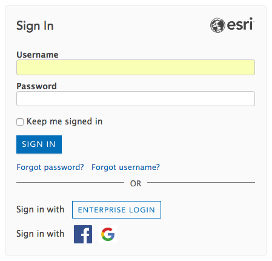
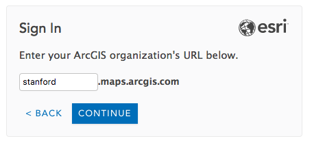

# ArcGIS Online is Now Available to All Stanford Affiliates with a Valid SUNetID!

We've implemented Single Sign-On for ArcGIS.com! This means that you no longer need to go through the Stanford Geospatial Center to get an account!

To get started making your own maps, go to ArcGIS.com , click on "Sign In" and click on the "ENTERPRISE LOGIN" button to begin the familiar Stanford Sign On...

Then, enter "stanford" in the space prompted, and click "CONTINUE."

Once you have gone through the Stanford SSO Login (dual authentication may be required) you should be redirected to the homepage of the Stanford Geospatial Center's ArcGIS Online Organization.

## Getting Started with ArcGIS Online

### Tutorials

You'll find that many of the Stanford Geospatial Center's workshops will make increasing use of ArcGIS Online for web mapping and field data collection applications. We're developing new materials all the time, so go to gis.stanford.edu to find out when the next workshops will be offered.

In the meantime, Esri is a juggernaut of online tutorial creation. Here are a few of the tutorials we have found most useful for new users:

* [Getting Started with ArcGIS Online](http://doc.arcgis.com/en/arcgis-online/get-started/get-started.htm) - http://doc.arcgis.com/en/arcgis-online/get-started/get-started.htm
* [Preparing and Deploying Your Data for Use in Collector for ArcGIS using ArcGIS Desktop and ArcGIS Online](http://doc.arcgis.com/en/collector/android/create-maps/prepare-data-desktop.htm) - http://doc.arcgis.com/en/collector/android/create-maps/prepare-data-desktop.htm

### A Few things to note:

### Don't Do Bulk Geocoding on ArcGIS.com
* **You have 200 credits to start with**. Please use them judiciously. Everything uses credits on ArcGIS.com, but Bulk Geocoding is particularly expensive.
**Bulk geocoding (placing more than 1000 addresses or placenames from a table on the map) SHOULD NOT be done through ArcGIS.com**, but should done via the [locator.stanford.edu](https://github.com/StanfordGeospatialCenter/SGC_Boilerplate/blob/master/Stanford_Locator_Service_Use.md) geocoding server. For more information, see [this guide](https://github.com/StanfordGeospatialCenter/SGC_Boilerplate/blob/master/Stanford_Locator_Service_Use.md).
* If you have more than 100k records to geocode, please [contact Stanford Geospatial Center Staff](mailto:davidmed@stanford.edu) about you needs.

### Learn to Use ArcGIS Desktop or ArcGIS Pro

ArcGIS Online is a fantastic online mapping platform for most users, but it's just a part of a well-integrated ecosystem of GIS Software. Both ArcGIS Desktop and ArcGIS Pro are well integrated with ArcGIS Online and allow seamless publishing of many resources, directly from the desktop software.

As noted, many tasks (including many analysis tools) consume credits in the ArcGIS online platform. The cost of many of the analysis tools in ArcGIS.com can be avoided by using ArcGIS Desktop or ArcGIS Pro as your primary analysis platforms and ArcGIS.com as your web map distribution platform!

Creating tiled map services from georeferenced map images can be costly in ArcGIS.com, as well. You can create [Tile Packages](https://blogs.esri.com/esri/arcgis/2016/07/11/tile-packages-hosted-tile-layers/) in ArcGIS Desktop or ArcGIS Pro, upload them to ArcGIS Online and serve them as tiled map services for very few credits.

If you are interested in learning to use ArcGIS Desktop, [please sign up for our Listserv](https://mailman.stanford.edu/mailman/listinfo/stanfordgis), so that you will receive our workshop and events announcements. 

We also make our workshop materials available for self-paced learning. Just go to [bit.ly/SGC_attendance](bit.ly/SGC_attendance), and fill out our Sign In form to gain access to the materials. You will find workshops for ArcGIS Desktop, QGIS, R and more. You can even come to the Stanford Geospatial Center's computer lab at Branner Earth Sciences Library, and do the tutorials with support from our GIS Assistants, close at hand to help you. 

Esri provides a number of tutorials, built right into the Help system of ArcGIS Desktop. You can find them in the Online Help system, at [http://desktop.arcgis.com/en/arcmap/10.5/get-started/introduction/arcgis-tutorials.htm](http://desktop.arcgis.com/en/arcmap/10.5/get-started/introduction/arcgis-tutorials.htm)

### Move Your Content **BEFORE** You Leave Stanford!

You can use the ArcGIS Online Assistant to move your content from stanford.maps.arcgis.com to your own Developer Account, but you need to do it before your  SUNetID is deactivated.

* Create an [ArcGIS Developer account](https://developers.arcgis.com/sign-up), which includes an one-person ArcGIS Online for Organizations account.
* Go to [https://ago-assistant.esri.com/](https://ago-assistant.esri.com/) and use the "I Want To... Copy Items..." tool to transfer your items from your Stanford account to your Developer account.
