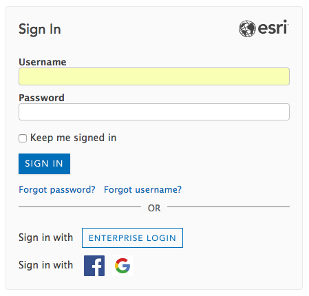

# ArcGIS Online is Now Available to All Stanford Affiliates with a Valid SUNetID!

We've implemented Single Sign-On for ArcGIS.com! This means that you no longer need to go through the Stanford Geospatial Center to get an account!

To get started making your own maps, go to ArcGIS.com , click on "Sign In" and click on the "ENTERPRISE LOGIN" button to begin the familiar Stanford Sign On...

Then, enter "stanford" in the space prompted, and click "CONTINUE."

Once you have gone through the Stanford SSO Login (dual authentication may be required) you should be redirected to the homepage of the Stanford Geospatial Center's ArcGIS Online Organization.

## Getting Started with ArcGIS Online

### A Few things to note:

### Don't Do Bulk Geocoding on ArcGIS.com
* **You have 200 credits to start with**. Please use them judiciously. Everything uses credits on ArcGIS.com, but Bulk Geocoding is particularly expensive.
**Bulk geocoding (placing more than 1000 addresses or placenames from a table on the map) SHOULD NOT be done through ArcGIS.com**, but should done via the [locator.stanford.edu](https://github.com/StanfordGeospatialCenter/SGC_Boilerplate/blob/master/Stanford_Locator_Service_Use.md) geocoding server. For more information, see [this guide](https://github.com/StanfordGeospatialCenter/SGC_Boilerplate/blob/master/Stanford_Locator_Service_Use.md).
* If you have more than 100k records to geocode, please [contact Stanford Geospatial Center Staff](mailto:davidmed@stanford.edu) about you needs.
