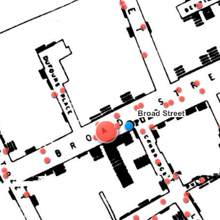

# Google Earth Engine 101:

## Google Earth Engine 101: An introduction to Earth Engine for absolute beginners  

Date: Fri, January 22, 2021  
Time: 1:30 PM – 3:00 PM PST  
Venue: Zoom Workshop  

### Meet Earth Engine

[Google Earth Engine](https://developers.google.com/earth-engine/) is a geospatial processing service. With Earth Engine, you can perform geospatial processing at scale, powered by Google Cloud Platform. The purpose of Earth Engine is to:
Provide an interactive platform for geospatial algorithm development at scale
Enable high-impact, data-driven science
Make substantive progress on global challenges that involve large geospatial datasets

Google Earth Engine combines a multi-petabyte catalog of satellite imagery and geospatial datasets with planetary-scale analysis capabilities and makes it available for scientists, researchers, and developers to detect changes, map trends, and quantify differences on the Earth's surface.

**Presenter**: [Stace Maples](mailto:maples@stanford.edu)
_Please note that this workshop is for Stanford University affiliates, only._

**Description**: The Earth Engine API (application programming interface) provides the ability to create your own algorithms to process raster and vector imagery. This session is geared toward people who would like to analyze satellite and vector data. The session will be hands-on, using the Earth Engine Javascript code editor.

The first part of the class will be an overview of the Google Earth Engine Platform, and Remote Sensing, in general. The second half will focus on accessing imagery, creating composites, and running analyses over stacks of images, computing statistics on imagery, creating charts and exporting the results of your analyses.

**Prerequisites**: No previous experience with Earth Engine or JavaScript is necessary for the beginner workshop, but programming experience, basic knowledge of remote sensing and/or GIS are highly desirable. Willingness to learn programming is required. Participants with no programming experience will require additional attention.

Read more about Google Earth Engine [here](https://developers.google.com/earth-engine/), or browse the [Data Catalog](https://developers.google.com/earth-engine/datasets)

----  

# ArcGIS Online 101: A quick-start to exploring spatial data using ArcGIS Online

  

Date: Fri, January 22, 2021  
Time: 1:30 PM – 3:00 PM PST  
Venue: Zoom Workshop  

**Details**:   
This workshop aims to accomplish two things: Introduce participants to basic vocabulary, concepts and techniques for working with spatial data in research and introduce the interface and tools in ArcGIS Online, a web-based alternative to desktop GIS software. This introductory session will focus upon the fundamental concepts and skills needed to begin using ArcGIS Online for the exploration and analysis of spatial data.

**Topics will include**:

- How Webmaps work
- The ArcGIS Online User Interface
- Uploading data to AGO
- Using Web Map services in AGO
- Simple Analysis using spatial allocation and joins
- Using ArcGIS Online to create data
- Creating and sharing custom applications with ArcGIS Online

GIS Resources: Stanford's ArcGIS Online Organization Login - https://stanford.maps.arcgis.com

_____  

# QGIS 101: An Introduction to Desktop GIS with QGIS

Date: Fri, January 22, 2021  
Time: 1:30 PM – 3:00 PM PST  
Venue: Zoom Workshop  

Note: you MUST be a Stanford Affiliate to attend, valid SUnet ID required.
This introductory session will focus upon the fundamental concepts and skills needed to begin using Geographic Information Systems software for the exploration and analysis of spatial data using the open source GIS package QGIS. Topics will include:
What is GIS?
Spatial Data Models and Formats
Projections and Coordinate Systems
Basic Data Management
The QGIS User Interface
Simple Analysis using Visualization

This workshop will be held online. Participation will be via a short initial Zoom meeting followed by a self directed lab. Your instructor will be available via Zoom during the full workshop for help and questions.
Please visit the workshop landing page linked below for full instructions and links:
https://sites.google.com/stanford.edu/gis-online-workshops/intro-to-qgis

-----
