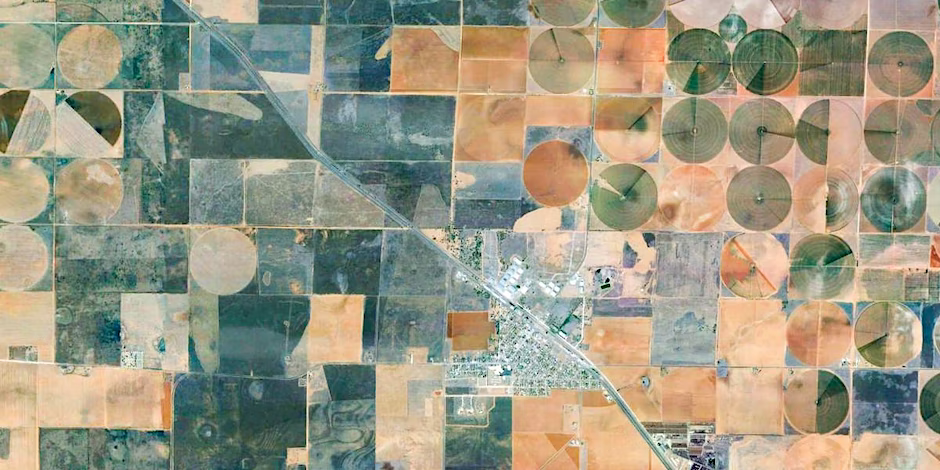
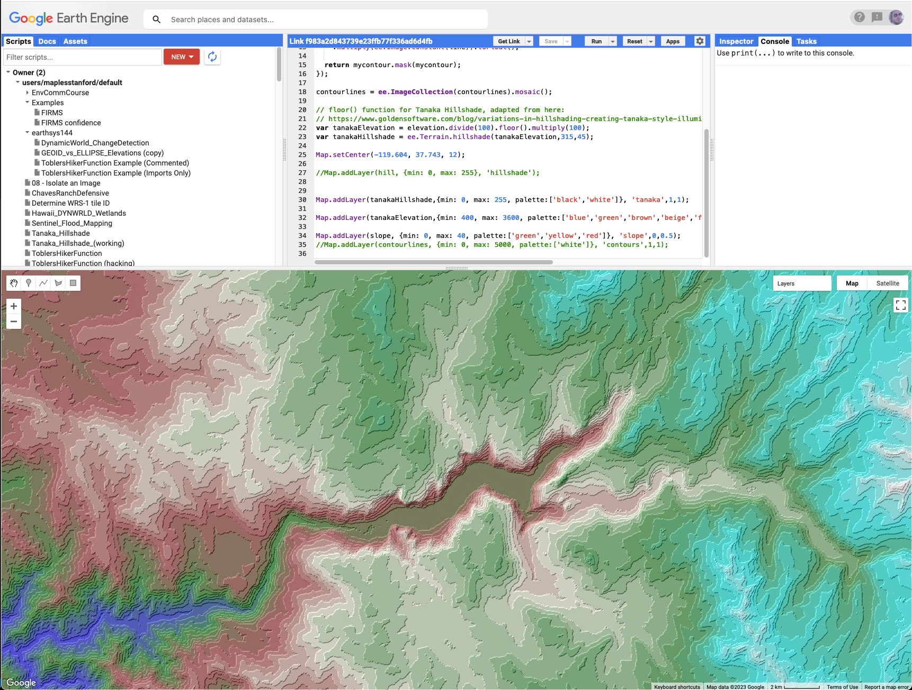

# Google Earth Engine 101: Introduction to Earth Engine for beginners
## Workshop Title

Google Earth Engine 101: Introduction to Earth Engine for beginners

## Workshop Primary Instructor(s)

Stace Maples

## Workshop Contact Email

maples@stanford.edu

## Workshop Short Description

Introduction to Earth Engine for beginners

## Workshop Full Description
_record a full description, including Outcomes, Prerequisites, etc..._

### Meet Earth Engine
Google Earth Engine is a geospatial processing service. With Earth Engine, you can perform geospatial processing at scale, powered by Google Cloud Platform. The purpose of Earth Engine is to:  
* Provide an interactive platform for geospatial algorithm development at scale
* Enable high-impact, data-driven science
* Make substantive progress on global challenges that involve large geospatial datasets

Google Earth Engine combines a multi-petabyte catalog of satellite imagery and geospatial datasets with planetary-scale analysis capabilities and makes it available for scientists, researchers, and developers to detect changes, map trends, and quantify differences on the Earth's surface.  

The Earth Engine API (application programming interface) provides the ability to create your own algorithms to process raster and vector imagery. This session is geared toward people who would like to analyze satellite and vector data. The session will be hands-on, using the Earth Engine Javascript code editor.  

The first part of the class will be an introduction to  Remote Sensing, in general.  The second half will focus on introducing the Google Earth Engine Platform, and accessing imagery, creating composites, and running analyses over stacks of images, computing statistics on imagery, creating charts and exporting the results of your analyses.

_Please note that this workshop is for Stanford University affiliates, only._

Prerequisites: No previous experience with Earth Engine or JavaScript is necessary for the beginner workshop, but programming experience, basic knowledge of remote sensing and/or GIS are highly desirable. Willingness to learn programming is required. Participants with no programming experience will require additional attention. 

### Get Access to Google Earth Engine Immediately!
If you are registering with a @Stanford.edu email address, it is possible that you already have access to Google Earth Engine, through the Stanford Geospatial Center's collaboration with The Stanford Doerr School of Sustainability. You can test this by going to https://code.earthengine.google.com/f983a2d843739e23ffb77f336ad6d4fb and logging in with your Stanford.edu credentials. The link should load a script that will produce a "Tanaka Hillshade" map of the terrain in the Yosemite Valley. 

If you find that you do not currently have access to Google Earth Engine, through your Stanford.edu credentials, please email maples@stanford.edu, to request to be added to the Stanford Geospatial Center's organizational GEE account. 

_Please note that we are only able to provide access to users with valid Stanford.edu credentials, and a fully sponsored SUNetID._ 

## Workshop Required Time

3 hours

## Mode 
_In-person, Virtual or Hybrid_

## Workshop Location

Branner Earth Sciences Library

## Room

Teaching Corner

## Workshop Zoom Link

## Workshop Prerequisites
_any previous workshops that should be completed first, with links to self-paced versions, if available_

None

## Workshop Audience
_General Public, Stanford Community, Etc..._

Stanford Community

Please note that this workshop is for Stanford University affiliates, only. 

## Departments

  

## Preparation Document
_URL to pre-workshop preparation documentation  (software installations, etc...)_

Preparation: Please arrive with your own laptop.

### The Slides
The slides below are the same as those covered in the webinar video. You can open these slides in a separate widow in order to follow along and have access to the linked URLs.
https://slides.com/staceymaples/gee101/embed
### The Sample Scripts
Once you have signed up for and received confirmation of your Google Earth Engine account, you can copy the script repository for this webinar by clicking on the following link, which will redirect you to the Google Earth Engine Code Editor and import a series of scripts designed to introduce you to the basic mechanics of working in Google Earth Engine.
https://goo.gl/9f9NgB

## Workshop Doc/Self-Paced Version Link
_URL to Self-Paced Materials, if available_

## Workshop Eventbrite Header Image
_Guidelines for image files_

   * File type must be a JPEG or PNG.
   * The recommended image size is at least 2160 x 1080px.
   * The width to length ratio should be 2:1. This means your event image should be a horizontal image that is twice as wide as it is tall. You can crop your image when you upload it.
   * Image file must be no larger than 10MB.
   * You must own the images you upload or have permission from the copyright holder to use them.

  

## Workshop Localist/ events.stanford.edu Image
_Best Practices_

   * Photos should be, at a minimum, 940 x 557px
   * Rectangular photos will translate better than square photos in Localist
   * Use non-text-heavy photos as there are multiple viewpoints they’ll be referenced
   * If you must use text-heavy photos, aim for the text to be as close to the center of the image as possible.
   * Aim for photos without too much white space for a better end-look

  