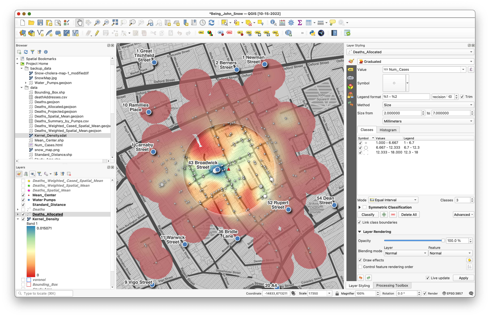

# QGIS 101 Workshop Boilerplate Template
## Workshop Title

QGIS 101: The basics of geoprocessing and spatial data carpentry, with QGIS  

## Workshop Primary Instructor(s)

Stace Maples

## Workshop Contact Email

maples@stanford.edu

## Workshop Short Description
_record a tweet length description, here_

Introducing participants to basic vocabulary, concepts and techniques for working with spatial data in research and introduce the interface and tools in QGIS, a free & open source desktop GIS software.

## Workshop Full Description
_record a full description, including Outcomes, Prerequisites, etc..._

This workshop aims to accomplish two things: Introduce participants to basic vocabulary, concepts and techniques for working with spatial data in research and introduce the interface and tools in QGIS, a free & open source desktop GIS software. This introductory session will focus upon the fundamental concepts and skills needed to begin using Geographic Information Systems software for the exploration and analysis of spatial data using the QGIS platform.

Topics will include:

* What is GIS?
* Spatial Data Models and Formats
* Projections and Coordinate Systems
* Basic Data Management
* The QGIS User Interface
* Simple Analysis using Visualization
* Creating Spatial Datasets
* Proximity and Overlay Analysis
* Hotspot Mapping
* Cartographic Presentation & Export

## Workshop Required Time

3 hours

## Mode 
_In-person, Virtual or Hybrid_

## Workshop Location

Branner Earth Sciences Library

## Room

Teaching Corner

## Workshop Zoom Link

## Workshop Prerequisites
_any previous workshops that should be completed first, with links to self-paced versions, if available_

None

## Workshop Audience
_General Public, Stanford Community, Etc..._

Stanford Community

## Departments

  

## Preparation Document
_URL to pre-workshop preparation documentation  (software installations, etc...)_

## Workshop Doc/Self-Paced Version Link
_URL to Self-Paced Materials, if available_

## Workshop Eventbrite Header Image
_Guidelines for image files_

   * File type must be a JPEG or PNG.
   * The recommended image size is at least 2160 x 1080px.
   * The width to length ratio should be 2:1. This means your event image should be a horizontal image that is twice as wide as it is tall. You can crop your image when you upload it.
   * Image file must be no larger than 10MB.
   * You must own the images you upload or have permission from the copyright holder to use them.

  

## Workshop Localist/ events.stanford.edu Image
_Best Practices_

   * Photos should be, at a minimum, 940 x 557px
   * Rectangular photos will translate better than square photos in Localist
   * Use non-text-heavy photos as there are multiple viewpoints they’ll be referenced
   * If you must use text-heavy photos, aim for the text to be as close to the center of the image as possible.
   * Aim for photos without too much white space for a better end-look

  