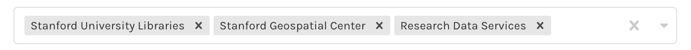

# Workshop Boilerplate Template
## Workshop Title

## Workshop Instructor(s)

## Workshop Contact Email

## Workshop Short Description
_record a tweet length description, here_

## Workshop Full Description
_record a full description, including Outcomes, Prerequisites, etc..._

## Workshop Date

## Workshop Start Time

## Workshop End Time

## Repeating

## Mode 
_In-person, Virtual or Hybrid_

## Workshop Location

## Room

## Workshop Zoom Link

## Workshop Prerequisites
_any previous workshops that should be completed first, with links to self-paced versions, if available_

## Workshop Audience
_General Public, Stanford Community, Etc..._

## Departments

  

## Preparation Document
_URL to pre-workshop preparation documentation  (software installations, etc...)_

## Workshop Doc/Self-Paced Version Link
_URL to Self-Paced Materials, if available_

## Workshop Eventbrite Header Image
_Guidelines for image files_

   * File type must be a JPEG or PNG.
   * The recommended image size is at least 2160 x 1080px.
   * The width to length ratio should be 2:1. This means your event image should be a horizontal image that is twice as wide as it is tall. You can crop your image when you upload it.
   * Image file must be no larger than 10MB.
   * You must own the images you upload or have permission from the copyright holder to use them.

## Workshop Localist/ events.stanford.edu Image
_Best Practices_

   * Photos should be, at a minimum, 940 x 557px
   * Rectangular photos will translate better than square photos in Localist
   * Use non-text-heavy photos as there are multiple viewpoints they’ll be referenced
   * If you must use text-heavy photos, aim for the text to be as close to the center of the image as possible.
   * Aim for photos without too much white space for a better end-look
